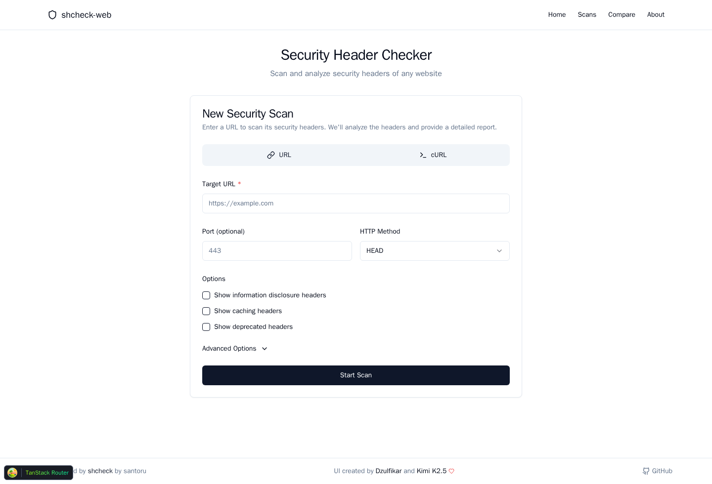
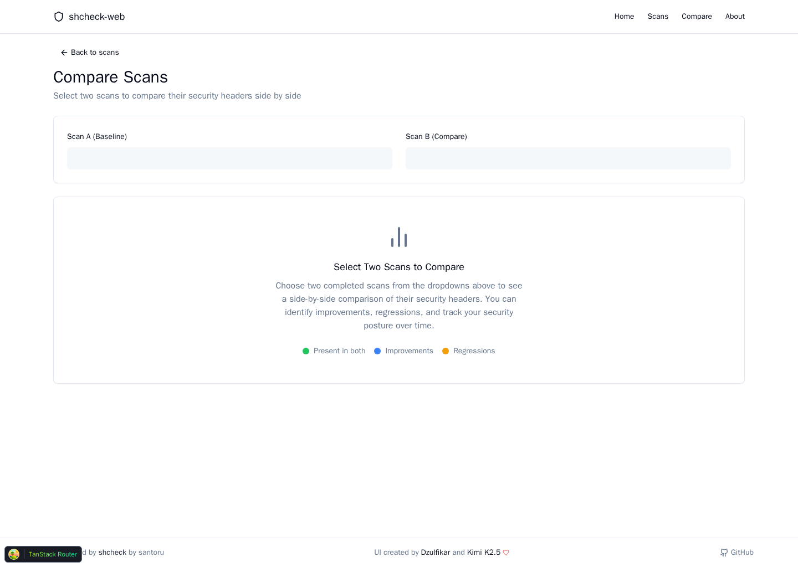
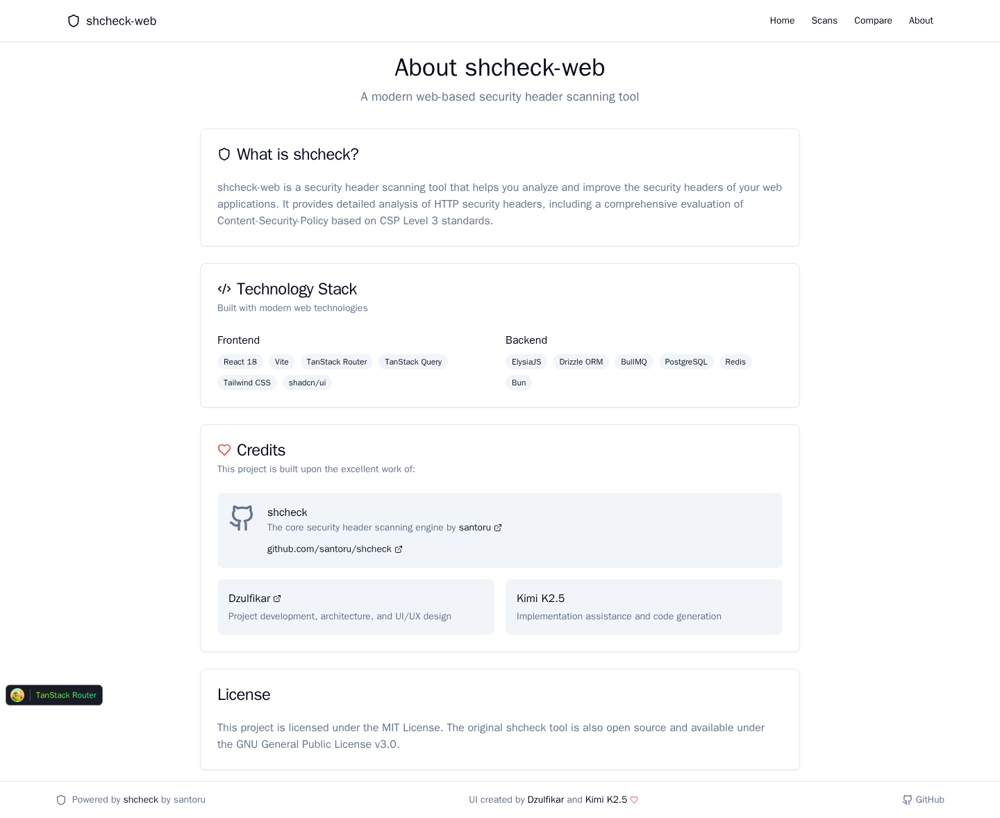

# shcheck-web

A web interface for security header scanning, powered by the original [shcheck](https://github.com/santoru/shcheck) engine.

## Important Credit

This project depends on **shcheck**, the core scanner created by **[santoru](https://github.com/santoru)**.

- Original tool: [santoru/shcheck](https://github.com/santoru/shcheck)
- shcheck license: GNU GPL v3 (or later)

## What This Project Is

`shcheck-web` adds a modern full-stack UI and workflow on top of shcheck so you can:

- run single and bulk security header scans
- paste cURL commands and auto-extract scan parameters
- monitor scan progress in real time
- evaluate CSP headers with CSP Level 3 checks
- compare scans over time
- keep scan history and export PDF reports

## UI Screenshots

### Home / New Scan



### Compare Scans



### About / Credits



## Architecture (High Level)

```text
React + Vite (frontend)
        |
        v
ElysiaJS + Bun (backend API)
        |
        +--> BullMQ + Redis (scan queue)
        |
        +--> PostgreSQL + Drizzle (persistence)
        |
        +--> Python shcheck (scanner engine)
```

## Tech Stack

- Frontend: React 18, Vite, TanStack Router, TanStack Query, Tailwind CSS, shadcn/ui
- Backend: ElysiaJS, Bun, Drizzle ORM
- Infra: PostgreSQL, Redis, BullMQ
- Scanner: Python [shcheck](https://github.com/santoru/shcheck)

## Quick Start

### Prerequisites

- Docker + Docker Compose
- Make (optional)

### Run in Development

```bash
make dev
```

or:

```bash
docker-compose up --build
```

### Service URLs

- Frontend: [http://localhost:3000](http://localhost:3000)
- Backend API: [http://localhost:3001](http://localhost:3001)
- Swagger: [http://localhost:3001/swagger](http://localhost:3001/swagger)

## Useful Commands

```bash
make dev            # start all services
make stop           # stop services
make clean          # stop and remove volumes
make logs-backend   # backend logs
make db-push        # apply schema changes
make test           # run all tests
```

## Scanning Local Services from Docker

If your target runs on your host machine, use `host.docker.internal` instead of `localhost`.

Example:

```text
http://host.docker.internal:9090
```

## Credits

- **Original scanner:** [shcheck](https://github.com/santoru/shcheck) by [santoru](https://github.com/santoru)
- Web app implementation: [Dzulfikar](https://github.com/dzulfiikar) and Kimi K2.5

## License

- This repository: GNU GPL v3 (or later)
- Scanner (`shcheck`): GNU GPL v3 (or later)
